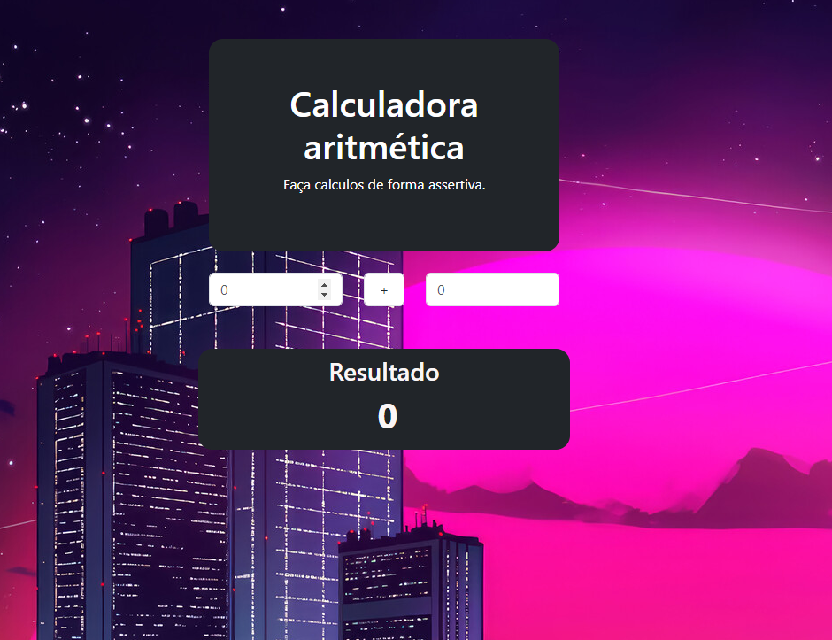

# calculaVuejs

Este exercicío foi proposto pela escola de programação EBAC

## Recommended IDE Setup

[VSCode](https://code.visualstudio.com/) + [Volar](https://marketplace.visualstudio.com/items?itemName=Vue.volar) (and disable Vetur).

A entrega deste exercício consiste em:

• Criar um projeto utilizando VueJS;

• Este projeto será uma calculadora aritmética;

• Deverá conter dois campos para inserir os números;

• Um campo do tipo select para escolher a operação aritmética;

• Ao alterar os valores o cálculo já deverá ser realizado, sem precisar clicar em nenhum botão;

• Crie um repositório no Github para esta tarefa e nos envie o link pela plataforma. 

Calculadora Calculadora VueJS</a>

## Customize configuration

See [Vite Configuration Reference](https://vitejs.dev/config/).

## Project Setup

```sh
npm install
```

### Compile and Hot-Reload for Development

```sh
npm run dev
```

### Compile and Minify for Production

```sh
npm run build
```
Autor Viviane Aguiar &copy; Todos os direitos reservados - 2024